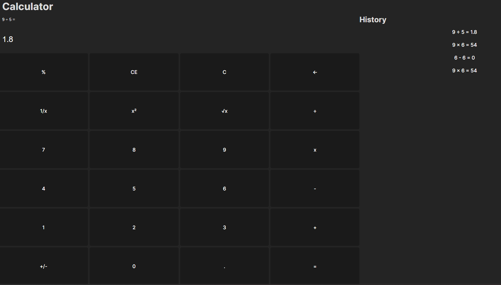

Calculator Project

This calculator is a mimic of the windows version of a calculator

Functionalities:

- The user can do basic calculations
- 24 different button
- The user can click on the history to bring back old calculations
- Display the recent expression/equation after pressing an operator or equal.

Built With:

- React
- Typescript
- Vite
- Nodejs

Key Concepts Learned:

- useStates
- Const Functions
- Creating Components
- Interface to pass elements through to components
